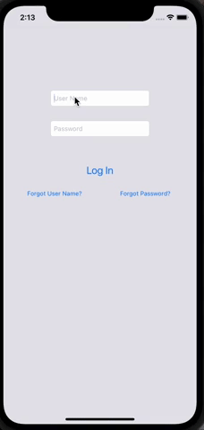
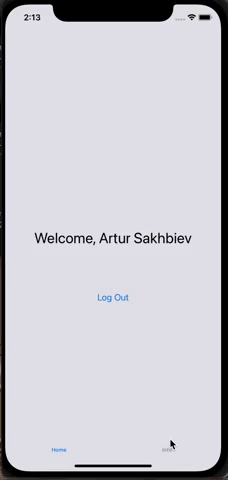

# ProfileLogInApp
## Учебный проэкт

Приложение  представляет из себя несколько экранное приложение с информацией о разработчике.
В разаработке использовалась схема MVC , передача данных между экранами осуществляется через segue. 
Так же в прэкте используются Алерт контроллеры для подсказки Логина и пароля на первом экране , при возврате на первый экран , данные из строковых полей удаляются 

## Educational project

The application is a multi-screen application with information about the developer.
The MVC scheme was used in the development, data transfer between screens is carried out through segue.
Also in the project, Alert controllers are used to prompt the Login and password on the first screen, when returning to the first screen, the data from the string fields is deleted

